# 📡 MessyDash Backend

[](https://nodejs.org/)
[](https://opensource.org/licenses/MIT)
[](https://www.fastify.io/)
[](https://www.typescriptlang.org/)

**MessyDash Backend** is a high-performance, secure relay server designed to bridge mobile devices and desktop clients. It enables real-time SMS relaying, contact synchronization, and bridge status monitoring via a persistent WebSocket connection and RESTful webhooks.

---

## ✨ Features

- 🔐 **Secure by Default**: Simple header-based API key authentication for all endpoints.
- ⚡ **Real-time Bridge**: Persistent WebSocket connection with sub-millisecond message routing.
- 📱 **SMS Relay**: Receive SMS via HTTP webhooks and send messages through a persistent mobile bridge.
- 📇 **Contact Sync**: Automated contact synchronization with SQLite persistence and searchable API.
- 🐳 **Docker Ready**: Multi-stage production-optimized Docker build with Docker Compose support.
- 🛠️ **Developer Friendly**: Schema validation with Zod, fully typed with TypeScript.

---

## 🚀 Quick Start

### 1. Local Development

```bash
# Install dependencies
npm install

# Setup environment
cp .env.example .env
# Edit .env and set your API_KEY

# Launch development server (with hot reload)
npm run dev
```

### 2. Docker Deployment (Recommended)

```bash
# One-command startup
docker-compose up -d
```

---

## 🛠️ Configuration

The server is configured via environment variables (see `.env.example`):

| Variable | Default | Description |
|----------|---------|-------------|
| `PORT` | `3000` | Server port |
| `HOST` | `0.0.0.0` | Listen address |
| `API_KEY` | - | **Required** for authentication |
| `DATABASE_PATH` | `./data/messydash.db` | Path to SQLite database |
| `NODE_ENV` | `development` | `production`, `development`, or `test` |

---

## 🔌 API Reference

### HTTP Endpoints

> All requests (except `/health`) require `X-API-KEY` header.

| Endpoint | Method | Description |
|----------|--------|-------------|
| `/api/v1/health` | `GET` | System health, version & connection stats |
| `/api/v1/status` | `GET` | Current bridge status (phone online/offline) |
| `/api/v1/contacts` | `GET` | Searchable contact list (`?q=query`) |
| `/api/v1/incoming` | `POST` | Webhook for inbound SMS from phone |

### WebSocket Protocol (`/api/v1/ws`)

Connect using: `ws://{host}/api/v1/ws?client={phone|desktop}`

#### Outbound SMS (Desktop -> Phone)
```json
{
  "type": "sms",
  "to": "+1555123456",
  "msg": "Hello from MessyDash!"
}
```

#### Contact Sync (Phone -> Server)
```json
{
  "type": "contacts",
  "data": [
    { "name": "Alice", "number": "+1..." },
    { "name": "Bob", "number": "+1..." }
  ]
}
```

---

## 🏗️ Architecture

```mermaid
flowchart LR
    A[📱 Android Phone] <-->|WS / HTTPS| B{📡 MessyDash Relay}
    B <-->|WS / HTTP| C[💻 Desktop UI]
    B --- D[(SQLite)]
```



---

## 📄 License

Distributed under the MIT License. See `LICENSE` for more information.

---

<p align="center">Made with ❤️ for the MessyDash project</p>
